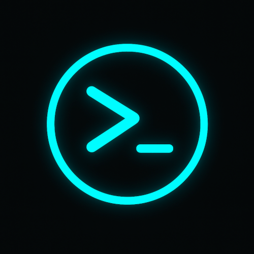
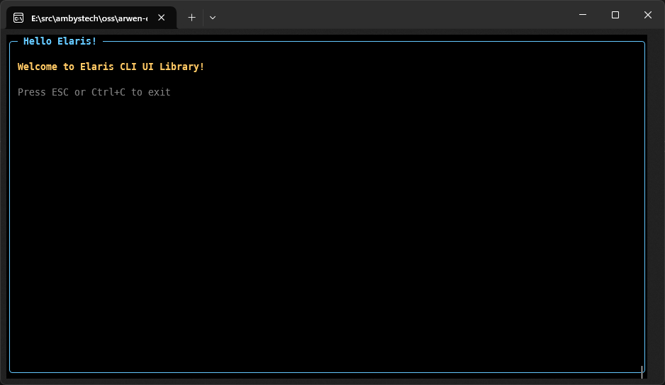
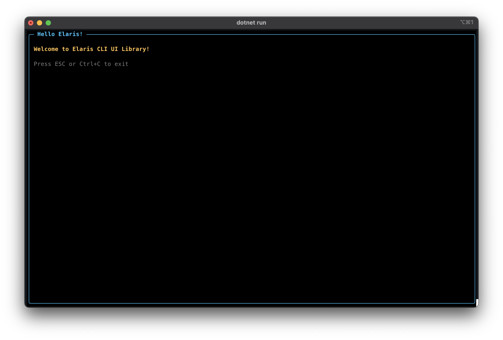

# Ambystech.Elaris.UI



[](https://www.nuget.org/packages/Ambystech.Elaris.UI/)
[](https://opensource.org/licenses/MIT)
=======================
A lightweight Terminal UI library for .NET with true 24-bit RGB color support. Built for modern terminals with cross-platform support.

## Features

- **True 24-bit RGB Color**: Full truecolor support via ANSI escape sequences
- **Zero Dependencies**: Pure .NET implementation with no external packages
- **Cross-Platform**: Works on Windows, macOS, and Linux
- **Modern Architecture**: Clean, extensible widget-based design
- **High Performance**: Double-buffered rendering with minimal overhead
- **Multi-Target**: Supports .NET 8.0 and .NET 9.0

## Quick Start

### Installation

```bash
dotnet add package Ambystech.Elaris.UI
```

### Basic Usage

```csharp
using Ambystech.Elaris.UI;

// Create application
var app = new Application();

// Create main window
var window = new Window("Hello Elaris")
{
    Width = 80,
    Height = 24
};

// Add widgets
var label = new Label("Welcome to Elaris!")
{
    ForegroundColor = Color.FromRgb(100, 200, 255)
};
window.Add(label);

// Run application
app.Run(window);
```

### Cross Platform Compatibility

Elaris.UI is designed to work seamlessly across Windows, macOS, and Linux terminals that support ANSI escape codes. Ensure your terminal supports truecolor for the best experience.

#### Windows Terminal



#### iTerm2 (macOS)


## Building from Source

```bash
# Clone repository
git clone https://github.com/ambystechcom/Ambystech.Elaris.UI.git elaris
cd elaris/lib

# Restore dependencies
dotnet restore

# Build library
dotnet build

# Run tests
dotnet test
```

## Architecture

### Core Components

- **Screen**: Terminal screen abstraction with buffering
- **Widget**: Base class for all UI components
- **EventLoop**: Main application loop and event handling
- **AnsiRenderer**: 24-bit RGB color rendering via ANSI codes
- **InputHandler**: Keyboard and mouse input processing

### Widget Hierarchy

```
Widget (abstract base)
├── Container
│   ├── Window
│   ├── Frame
│   └── Panel
├── Label
├── TextField
├── TextView
└── StatusBar
```

## License

MIT License - see LICENSE file for details

## Contributing

Contributions welcome! Please open an issue or PR on GitHub.

## Links

- GitHub: https://github.com/ambystechcom/Ambystech.Elaris.UI
- NuGet: https://www.nuget.org/packages/Ambystech.Elaris.UI
- Documentation: (Coming soon)
