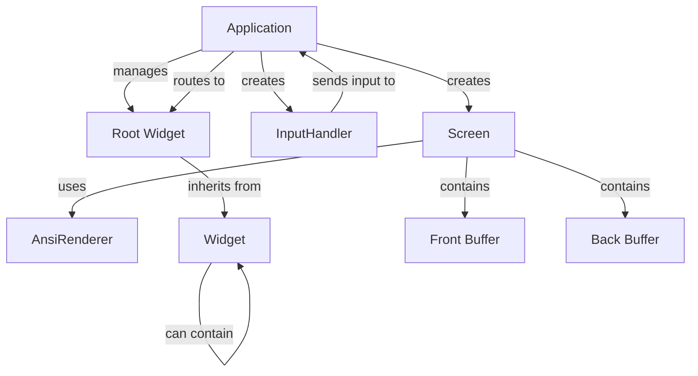
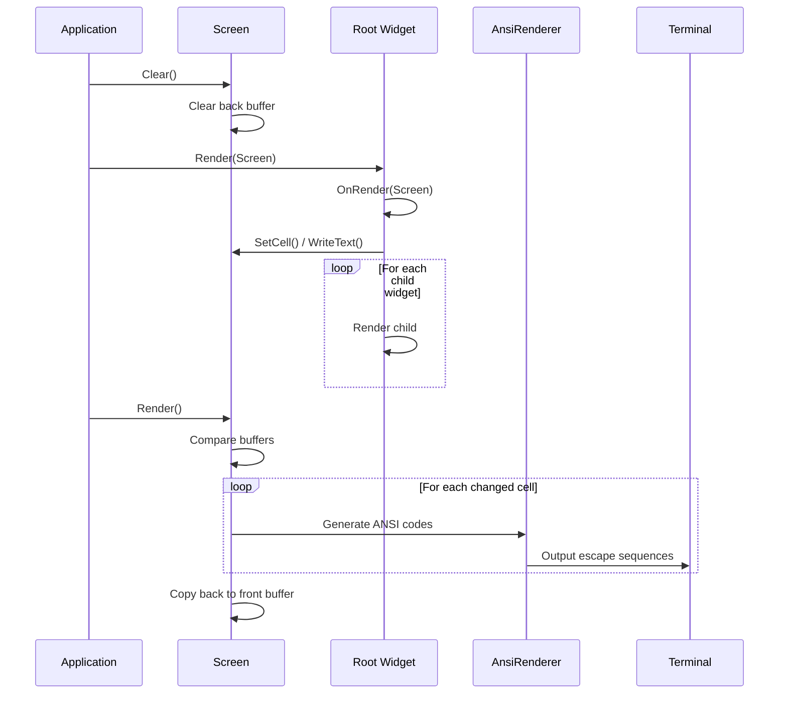
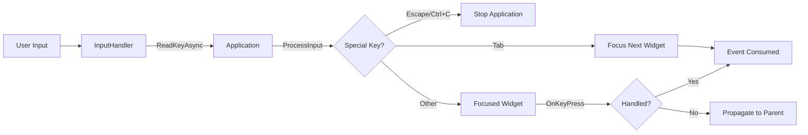
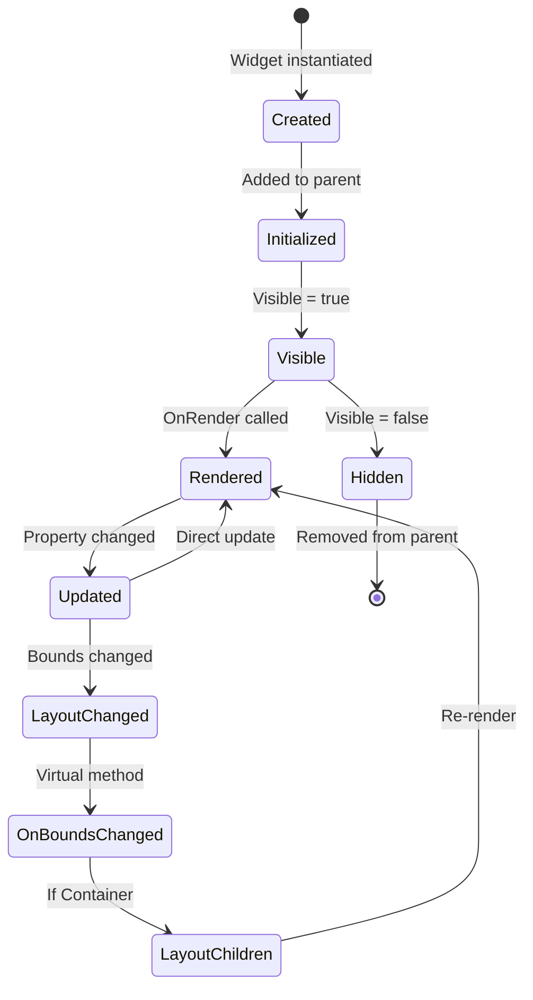

Elaris.UI is built on a clean, modular architecture that separates concerns between rendering, input handling, and widget management. This page explains the core components and how they work together.

## System Overview

Elaris.UI follows a widget-based architecture where all UI elements inherit from a base `Widget` class. The `Application` class orchestrates the event loop, manages input, and coordinates rendering through the `Screen` class.

## Core Components

### Application

The `Application` class is the entry point and orchestrator of the Elaris.UI system. It manages:

- **Event Loop**: Runs at 30 FPS by default (configurable via `TargetFps`)
- **Focus Management**: Handles keyboard focus and Tab navigation between focusable widgets
- **Input Processing**: Delegates keyboard input to the focused widget
- **Window Resize Handling**: Automatically adjusts widget bounds when terminal is resized
- **Lifecycle Management**: Initializes and shuts down the terminal properly

### Screen

The `Screen` class provides a double-buffered rendering system:

- **Front Buffer**: The currently displayed frame
- **Back Buffer**: The frame being prepared for the next render
- **Incremental Rendering**: Only updates cells that have changed
- **Thread Safety**: Uses locks to ensure safe concurrent access

### AnsiRenderer

The `AnsiRenderer` class converts colors and styles to ANSI escape sequences:

- **24-bit RGB Support**: Full truecolor via `38;2;R;G;B` and `48;2;R;G;B` sequences
- **Text Styles**: Bold, italic, and underline support
- **Terminal Control**: Cursor movement, screen clearing, alternate buffer management

### InputHandler

The `InputHandler` class processes keyboard input:

- **Asynchronous Reading**: Non-blocking key input
- **Cancellation Support**: Respects cancellation tokens for clean shutdown
- **Key Availability**: Checks for available input without blocking

### Widget Hierarchy

All UI elements inherit from the abstract `Widget` class, which provides:

- **Parent-Child Relationships**: Widgets can contain other widgets
- **Layout Management**: Position and size properties
- **Rendering Pipeline**: Virtual `OnRender` method for custom rendering
- **Event Handling**: Virtual methods for keyboard and mouse input
- **Focus Management**: Support for focusable widgets

## Component Relationships

## Rendering Pipeline

The rendering process follows a clear pipeline:

## Event Flow

Input events flow through the system as follows:

## Widget Lifecycle

Widgets go through several lifecycle stages:

## Double-Buffered Rendering

Elaris.UI uses double buffering to ensure smooth rendering:

1. **Back Buffer**: Widgets render to the back buffer
2. **Comparison**: Screen compares back buffer with front buffer
3. **Incremental Update**: Only changed cells are output to terminal
4. **Buffer Swap**: Back buffer becomes the new front buffer

This approach minimizes terminal output and provides smooth, flicker-free rendering.

## Focus Management

Focus management allows keyboard navigation:

1. **Focusable Widgets**: Widgets override `IsFocusable` to return `true`
2. **Focus Collection**: Application collects all focusable widgets on startup
3. **Tab Navigation**: Tab/Shift+Tab cycles through focusable widgets
4. **Focus Events**: `OnFocus()` and `OnBlur()` virtual methods notify widgets

## Thread Safety

The rendering system is thread-safe:

- **Screen Operations**: All screen buffer operations are locked
- **Widget Rendering**: Widget rendering happens on the main thread
- **Input Handling**: Input is processed asynchronously but handled on main thread

## Performance Considerations

Elaris.UI is designed for performance:

- **Incremental Rendering**: Only changed cells are updated
- **Efficient Buffer Comparison**: Fast cell equality checks
- **Minimal Allocations**: Reuses buffers where possible
- **Configurable FPS**: Default 30 FPS balances smoothness and CPU usage

## Next Steps

- **[Base Widget](/widgets/base-widget)** - Learn about the widget base class
- **[Widgets](/widgets/)** - Explore available widgets
- **[Examples](/examples/)** - See the architecture in action

