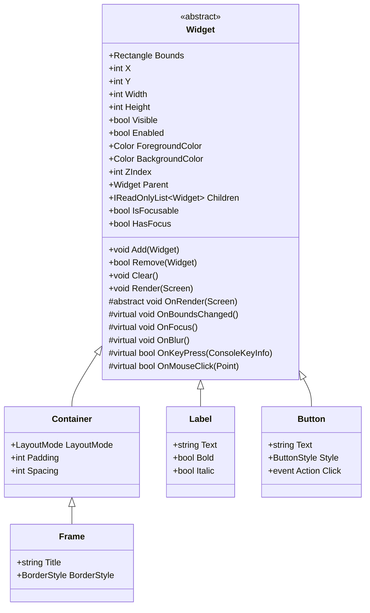

The `Widget` class is the abstract base class for all UI components in Elaris.UI. Understanding how widgets work is essential for building applications and creating custom widgets.

## Overview

Every UI element in Elaris.UI inherits from `Widget`. This includes containers, labels, buttons, input fields, and more. The widget system provides a consistent interface for:

- **Layout Management**: Position and size properties
- **Rendering**: Custom drawing via virtual methods
- **Parent-Child Relationships**: Hierarchical widget trees
- **Event Handling**: Keyboard and mouse input
- **Focus Management**: Support for focusable widgets
- **State Management**: Visibility, enabled state, and more

## Widget Hierarchy



## Properties

### Position and Size

#### `Bounds` (Rectangle)

The bounding rectangle of the widget, defining its position and size on the screen.

```csharp
widget.Bounds = new Rectangle(10, 5, 50, 20); // X=10, Y=5, Width=50, Height=20
```

#### `X`, `Y`, `Width`, `Height` (int)

Convenience properties for accessing and setting individual bounds components.

```csharp
widget.X = 10;
widget.Y = 5;
widget.Width = 50;
widget.Height = 20;
```

**Note**: Setting these properties triggers `OnBoundsChanged()`.

### Visibility and State

#### `Visible` (bool)

Controls whether the widget is rendered. Hidden widgets and their children are not rendered.

```csharp
widget.Visible = false; // Hide the widget
```

#### `Enabled` (bool)

Controls whether the widget can receive input. Disabled widgets are still rendered but don't respond to events.

```csharp
widget.Enabled = false; // Disable the widget
```

### Appearance

#### `ForegroundColor` (Color)

The foreground (text) color of the widget.

```csharp
widget.ForegroundColor = Color.White;
widget.ForegroundColor = ColorHelper.FromRgb(255, 200, 100);
```

#### `BackgroundColor` (Color)

The background color of the widget. Use `Color.Transparent` for no background.

```csharp
widget.BackgroundColor = Color.Black;
widget.BackgroundColor = Color.Transparent; // No background
```

#### `ZIndex` (int)

Controls rendering order. Higher Z-index values render on top of lower values.

```csharp
widget.ZIndex = 10; // Render above widgets with lower Z-index
```

### Hierarchy

#### `Parent` (Widget?)

The parent widget that contains this widget. `null` if the widget is not added to a parent.

```csharp
if (widget.Parent != null)
{
    Console.WriteLine($"Parent: {widget.Parent.GetType().Name}");
}
```

#### `Children` (IReadOnlyList\<Widget\>)

A read-only list of child widgets contained by this widget.

```csharp
foreach (var child in widget.Children)
{
    Console.WriteLine($"Child: {child.GetType().Name}");
}
```

### Focus

#### `IsFocusable` (bool, virtual)

Indicates whether the widget can receive keyboard focus. Override in derived classes to return `true`.

```csharp
public override bool IsFocusable => true; // Make widget focusable
```

#### `HasFocus` (bool)

Indicates whether the widget currently has keyboard focus.

```csharp
if (widget.HasFocus)
{
    // Widget is focused
}
```

## Methods

### Adding and Removing Children

#### `Add(Widget child)`

Adds a child widget to this widget. The child must not already have a parent.

```csharp
var container = new Container();
var label = new Label("Hello");
container.Add(label); // label.Parent is now container
```

**Throws**: `InvalidOperationException` if the child already has a parent.

#### `Remove(Widget child)`

Removes a child widget from this widget.

```csharp
container.Remove(label); // label.Parent is now null
```

**Returns**: `true` if the widget was removed, `false` if it wasn't found.

#### `Clear()`

Removes all child widgets.

```csharp
container.Clear(); // All children removed
```

### Rendering

#### `Render(Screen screen)`

Renders the widget and all its children to the screen. This method:

1. Checks if the widget is visible
2. Calls `OnRender()` for the widget itself
3. Recursively renders all children

**Note**: You typically don't call this directly; the `Application` class handles rendering.

#### `OnRender(Screen screen)` (abstract, protected)

Override this method to implement custom rendering for your widget.

```csharp
protected override void OnRender(Screen screen)
{
    // Draw widget content
    screen.WriteText(X, Y, "Hello", ForegroundColor, BackgroundColor);
}
```

## Virtual Methods and Hooks

### Lifecycle Hooks

#### `OnBoundsChanged()` (virtual, protected)

Called when the widget's bounds (X, Y, Width, or Height) change.

```csharp
protected override void OnBoundsChanged()
{
    base.OnBoundsChanged();
    // Update internal layout
    LayoutChildren();
}
```

#### `OnVisibleChanged()` (virtual, protected)

Called when the `Visible` property changes.

```csharp
protected override void OnVisibleChanged()
{
    base.OnVisibleChanged();
    // Handle visibility change
}
```

#### `OnEnabledChanged()` (virtual, protected)

Called when the `Enabled` property changes.

```csharp
protected override void OnEnabledChanged()
{
    base.OnEnabledChanged();
    // Update appearance for disabled state
}
```

### Child Management Hooks

#### `OnChildAdded(Widget child)` (virtual, protected)

Called when a child widget is added.

```csharp
protected override void OnChildAdded(Widget child)
{
    base.OnChildAdded(child);
    // Update layout when child is added
    LayoutChildren();
}
```

#### `OnChildRemoved(Widget child)` (virtual, protected)

Called when a child widget is removed.

```csharp
protected override void OnChildRemoved(Widget child)
{
    base.OnChildRemoved(child);
    // Clean up when child is removed
}
```

### Focus Hooks

#### `OnFocus()` (virtual, protected internal)

Called when the widget receives keyboard focus.

```csharp
protected internal override void OnFocus()
{
    base.OnFocus();
    // Update appearance to show focus
    _hasFocus = true;
}
```

#### `OnBlur()` (virtual, protected internal)

Called when the widget loses keyboard focus.

```csharp
protected internal override void OnBlur()
{
    base.OnBlur();
    // Restore normal appearance
    _hasFocus = false;
}
```

### Input Hooks

#### `OnKeyPress(ConsoleKeyInfo key)` (virtual, protected internal)

Called when a key is pressed and the widget has focus.

```csharp
protected internal override bool OnKeyPress(ConsoleKeyInfo key)
{
    if (key.Key == ConsoleKey.Enter)
    {
        // Handle Enter key
        PerformAction();
        return true; // Event handled
    }
    return false; // Let parent handle it
}
```

**Returns**: `true` if the event was handled, `false` to propagate to parent.

#### `OnMouseClick(Point position)` (virtual, protected internal)

Called when the mouse is clicked on the widget.

```csharp
protected internal override bool OnMouseClick(Point position)
{
    if (Bounds.Contains(position))
    {
        // Handle click
        PerformClick();
        return true;
    }
    return false;
}
```

## Creating Custom Widgets

To create a custom widget, inherit from `Widget` and implement `OnRender`:

```csharp
public class MyCustomWidget : Widget
{
    private string _text = "Custom Widget";
    
    public string Text
    {
        get => _text;
        set => _text = value ?? string.Empty;
    }
    
    protected override void OnRender(Screen screen)
    {
        if (!Visible || Width <= 0 || Height <= 0)
            return;
            
        // Draw background
        screen.FillRectangle(Bounds, ' ', ForegroundColor, BackgroundColor);
        
        // Draw text
        screen.WriteText(X, Y, _text, ForegroundColor, BackgroundColor);
    }
}
```

## Best Practices

1. **Always check bounds**: Verify `Width > 0` and `Height > 0` before rendering
2. **Respect visibility**: Don't render if `Visible` is `false` (base `Render` handles this)
3. **Handle focus**: Override `OnFocus` and `OnBlur` to provide visual feedback
4. **Return from OnKeyPress**: Return `true` to consume the event, `false` to propagate
5. **Call base methods**: Call `base.OnXxx()` in overridden lifecycle methods when appropriate

## Related Topics

- **[Container](/widgets/layout/container)** - Container widgets for layout
- **[Layout Modes](/widgets/layout/container#layout-modes)** - Understanding layout modes
- **[Focus Management](/architecture#focus-management)** - How focus works in Elaris.UI
- **[Rendering Pipeline](/architecture#rendering-pipeline)** - How widgets are rendered

